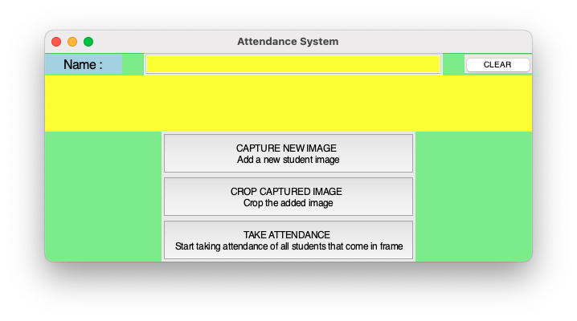
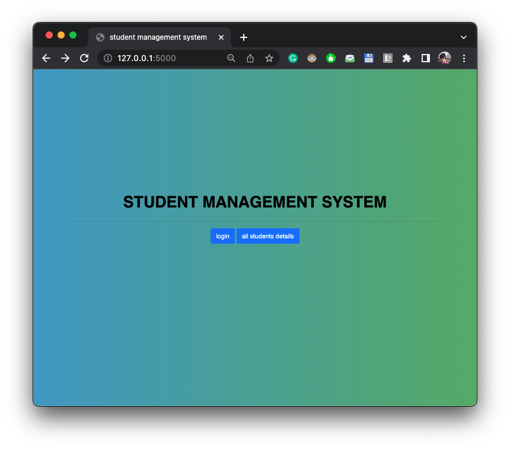
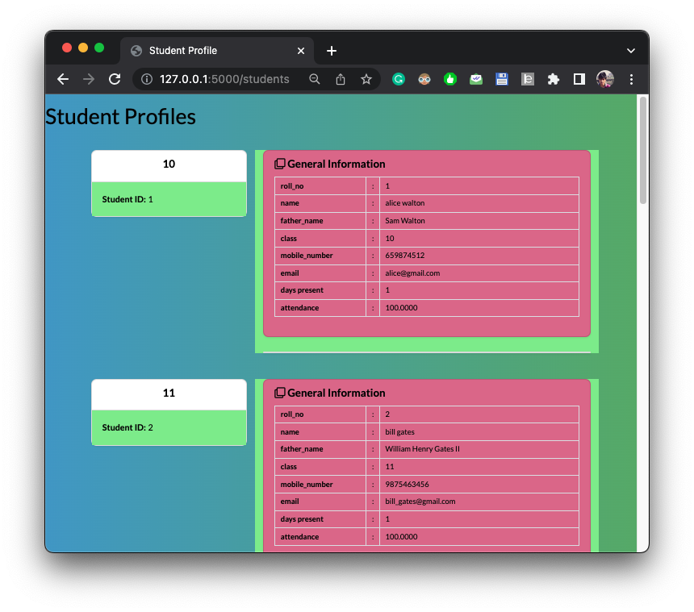
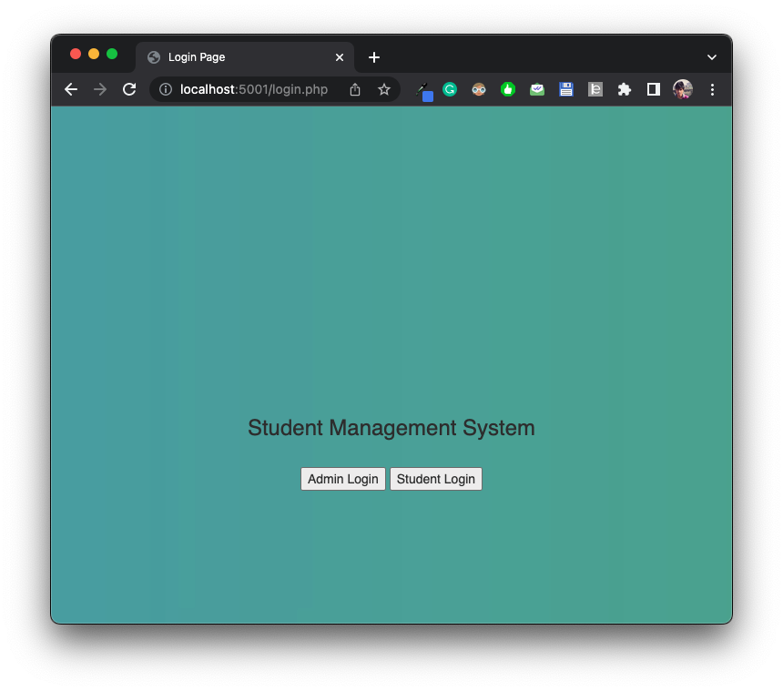
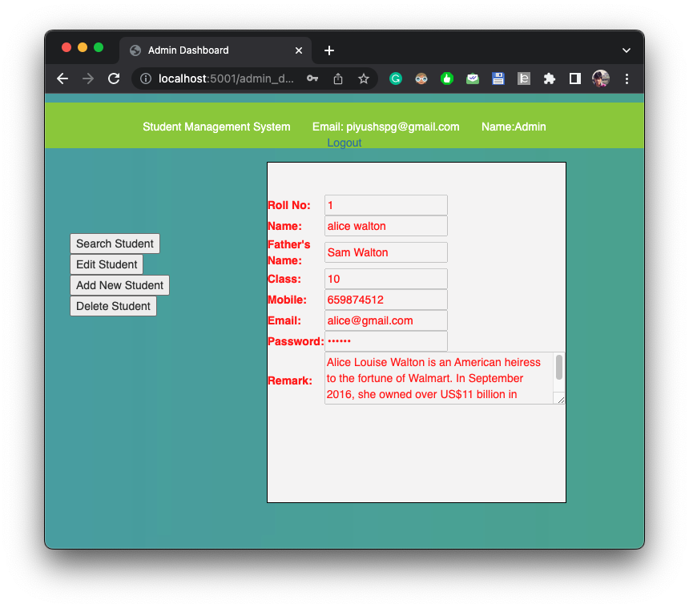

# Attendance System
Attendance system using Facial Recognition. This project was made as part of the Microsoft Student Engage program.

## Tech Stack
- Python
- Php and Flask
- Tkinter for GUI
- Mysql for database

## Install Dependencies

### Instructions for Mac
- Install php
  - `brew install php`
- Install mysql 
  - `brew install mysql`
- Start the mysql server
  - `brew services start mysql`
- Initialise the mysql server and fill the tables for project
  - `mysql -u root -e "source sms.sql;"`
  
### Instructions for Linux
- sudo apt-get update
- Install php
  - `sudo apt install php` (26.1MB)
- Install mysql 
  - `sudo apt install mysql-server` (262MB)
- Start the mysql server
  - `sudo /etc/init.d/mysql start`
- Initialise the mysql server and fill the tables for project
  - `sudo mysql -u root -e "source sms.sql;"`

### Instructions for Windows
- Download and install xampp https://www.apachefriends.org/index.html
- Copy the repo files to folder `c:\xampp\htdocs`
- Now open windows powershell
- Move to htdocs folder `cd c:\xampp\htdocs`. If you do `ls` you should see `README.md` file
- Open xampp and change the apache port to 5001 (by editing file httpd.conf)
- start the Apache (PHP) and MySql servers
- Initialise the mysql server and fill the tables for project
  - `c:\xampp\mysql\bin\mysql.exe -u root -e "source sms.sql;"`

### Common Instructions
- Make a conda environment with python `3.9`. We are using conda environment, you can have a look at this link if you want to install conda https://docs.conda.io/en/latest/miniconda.htm
  - Make a new environment `conda create -n microsoft_engage python=3.9`
  - Activate the environment `conda activate microsoft_engage`
- Install all the dependencies
  - Install dlib which is required for face recognition library
    - `conda install -c conda-forge dlib`
  - `pip install -r requirements.txt`

## Running
- Start the servers
  - Mac or ubuntu: `make run` 
  - Windows: `python Flaskmysql/app.py`
- Now open http://127.0.0.1:5000 in a browser
  - You will 2 options here
    - login - Admin can add new students or a student can edit his/her information in database 
    - all students detail - shows attendance of all the students in the database
    - [Screenshots of web pages](#screenshots-of-web-app) are added at the bottom
- Run `python attendance.py`
  - You can add new students image (or update existing images)
  - You can start taking attendance of all students in frame
  
  

## Stopping the servers
- Stop the mysql server after the run is complete
  - Mac: `brew services stop mysql`
  - Linux: `sudo /etc/init.d/mysql stop`
  - Windows: Just stop the php or mysql server using xampp

## Screenshots of web app
- **Home Page:** http://127.0.0.1:5000

- **Student Details Page:** Shows details of all students with calculated attendance. Attendance is calculated solely using the sql queries dynamically.

- **Login Page:** A student can login here to change his or her information in the database. An admin can also login, admin can add a new student or change details of any student in the database.

- **Admin Page**

  
## Some notes:
- I am using both flask and php because I was using php earlier and thought of connecting all my object detection code in python using Tinker to a webpage. But I later realised that Tkinter apps can not be started from webpages, so I was stuck with some of the code written in Flask.

## id and passwords:
- admin id ->piyushspg@gmail.com 
- admin password->12345678
  - students id->alice@gmail.com, bill_gates@gmail.com, elon_musk@gmail.com, jeff@gmail.com 
  - passwords(corresponding passwords) ->  alice1, billgates2, elonmusk4, jeffbezos5
                  